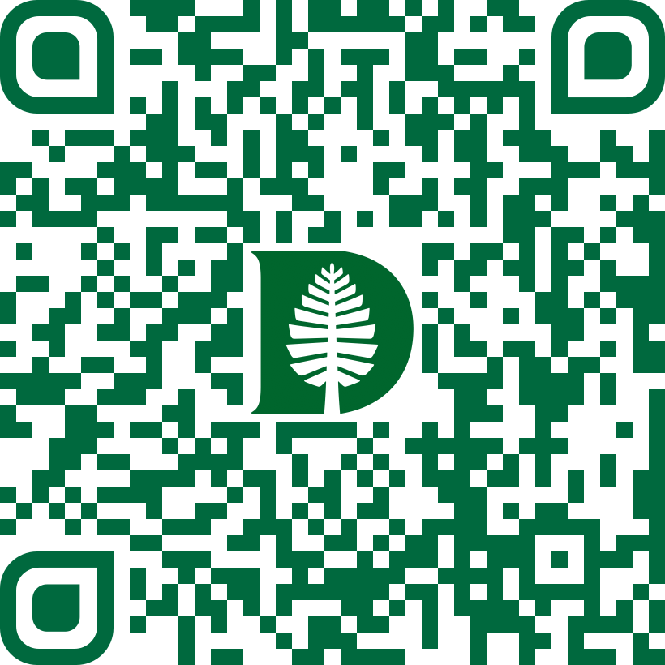

# Welcome Document
Dartmouth Libraries

<!--to render this document as both .pdf and .md enter the following in the terminal: quarto render docs/workshop-09-2026_welcome-doc.qmd-->

# Welcome Document

The Reproducible Research Group (Dartmouth Libraries and Research
Computing) is pleased to welcome you too our workshop!

# Concepts to Code: Building Good Computational Research Practices with R

Sept 2 & 3, 2026

Berry 180A (The LINK)

Baker-Berry Library, Dartmouth College

## Before the Workshop Begins

Download R and RStudio following the [instructions
here](https://rstudio-education.github.io/hopr/starting.html).

## What to bring

1.  Laptop and charger (unless your battery can last all day)
2.  *Optional*: a dataset you want to work with, preferably in `.csv`
    format if possible (if working with Excel, you can save an
    individual worksheet this way: **File** –\> **Save As** –\> from the
    file type dropdown menu select **CSV-UTF-8**)
3.  An open mind ready to learn

## Key Links / Resources

- [Registration Page](https://libcal.dartmouth.edu/event/17272420) with
  workshop description. *Note: register for both days!*
- [The Workshop Github
  repository](https://github.com/Dartmouth-Libraries/r_research-fundamentals_ws)
  - **Welcome Document (START HERE)**:
    [dartgo.org/f26_research-fundamentals](https://dartgo.org/f26_research-fundamentals)
    (QR code below)

- **DIRECT DOWNLOAD LINK** - *click here to download workshop
  materials*:
  [dartgo.org/f26_research-fundamentals_download](https://dartgo.org/f26_research-fundamentals_download)
  (QR code below)

\*If the above link doesn’t work for you, you can 1) go directly to our
[Github workshop
repository](https://github.com/Dartmouth-Libraries/r_research-fundamentals_ws),
select the green **Code** button and click on **Download ZIP**; or 2)
download [a copy of the zipped workshop folder from Google
Drive](https://drive.google.com/drive/folders/1mnuquh7BQi_y-d54NPjROEpxhdWR-Qby?usp=sharing).

## Instructors

### EMILY MYERS

Research Data Librarian, Research Facilitation (Dartmouth Libraries)

**Specialties**: quantitative social sciences, causal inference, data
analysis in R, data visualization

**Meet with me**: [dartgo.org/emily-cal](https://dartgo.org/emily-cal)

**Contact me**: <emily.h.myers@dartmouth.edu>

### KATIE OWERS BONNER

Senior Research Data Science Specialist, Research Facilitation
(Dartmouth Libraries)

**Specialties**: quantitative analysis, biological and medical research,
data visualization, programming in R

**Meet with me**: [dartgo.org/katie](https://dartgo.org/katie)

**Contact me**: <Katie.Owers.Bonner@dartmouth.edu>

### JEREMY MIKECZ

Research Data Science Specialist, Research Facilitation (Dartmouth
Libraries)

**Specialties**: bibliometrics, data visualization, digital humanities,
GIS & digital mapping, programming in Python & R, text analysis /
handwritten text recognition

**Meet with me**: [dartgo.org/jeremy](https://dartgo.org/jeremy)

**Contact me**: <jeremy.m.mikecz@dartmouth.edu>

## Research Facilitation

You can contact your instructors directly at the email addresses listed
above.

If you have a computational research or data-intensive project you need
help with, but aren’t sure who to ask, you can reach our whole
department at <Research.Facilitation@dartmouth.edu> and someone will
assist you.

To learn more about our group visit [our
webpage](https://www.library.dartmouth.edu/about-us/dartmouth-libraries/departments/research-facilitation).

## Facilities: Dartmouth Libraries

### The LINK (Berry 180A)

The LINK is a new teaching and learning space found on Berry Floor 1
directly across from the circulation desk (to the east). [Click
here](https://researchguides.dartmouth.edu/TheLINK) for more information
about this space.

### Accessible entrance

Handicap parking and an accessible entrance may be found on the East
side of Baker (on College Ave., see the library [Plan your
visit](https://www.library.dartmouth.edu/baker-berry/visit) page for
more detail).

### Restrooms

[Restroom
map](https://www.dartmouth.edu/library/bakerberry/docs/Bathroom_Locations_in_BakerBerry.pdf)

- **Men’s and women’s restrooms** are found just to the right of the
  circulation desk

- **All-gender, single-occupancy restrooms** - nearest locations:

  - In the stairwell behind the former Baker Café
  - In the Stacks, there are multiple near the elevator on the following
    floors (Basement + Floors 4, 5, and 6)

## Food & Drink

**A light breakfast (pastries / coffee) and boxed lunches from Lou’s
(sandwiches, chips) will be provided to all registered participants**.
Additional snacks and hot & cold drinks may be purchased at Novack Café
(7:30 am - 2:30 pm) just one floor down in Berry.

## Schedule

This workshop pairs Concepts lessons with Coding lessons.

In the **Concepts lessons** (“a” sessions), you will learn computational
research principles - ideas that apply regardless of tools used: from
file-naming conventions and project organization to reproducibility and
programming best practices.

In the **hands-on Coding lessons** (“b” sessions), you will apply and
practice what you learned in the Concepts sessions: i.e., setting up a
project in R Studio, and writing R code that explores, cleans, analyzes,
and visualizes your data.

### Day 1 (Wednesday Sept 2)

- **9:00 - 9:15 Welcome / Introductions / Get to know the people around
  you**
- **Session 1a: Research Questions & Project Design (9:15 - 10:15am)**
- *Break*
- **Session 1b: Starting a Research Project in R (10:30 - 12:00)**
- *Lunch*
- **Session 2a: Exploring your Data (12:45 - 1:45pm)**
- *Break*
- **Session 2b: Exploratory Data Analysis in R (2:00 - 3:30pm)**

### Day 2 (Thursday Sept 3)

- **9:00 - 9:15 Welcome / Intros**
- **Session 3a: Introduction to Data Cleaning for Analysis and
  Reproducible Research (9:15 - 10:15am)**
- *Break*
- **Session 3b: Data Cleaning with R (10:30 - 12:00)**
- *Lunch*
- **Session 4a: Computational / Reproducible Research Best Practices
  (12:45 - 1:45pm)**
- *Break*
- **Session 4b: Applying Reproducible Research Best Practices to your
  Own Projects in R (2:00 - 3:30pm)**

## Feedback

Our goal is to provide positive and meaningful educational experiences
for all participants in our workshops. Help us improve by letting us
know what we did right, what we can improve on, and what other workshops
/ offerings you would like to see in the future. **Please fill out this
survey at the end of our workshop:
[dartgo.org/feedback](https://dartgo.org/feedback).**
